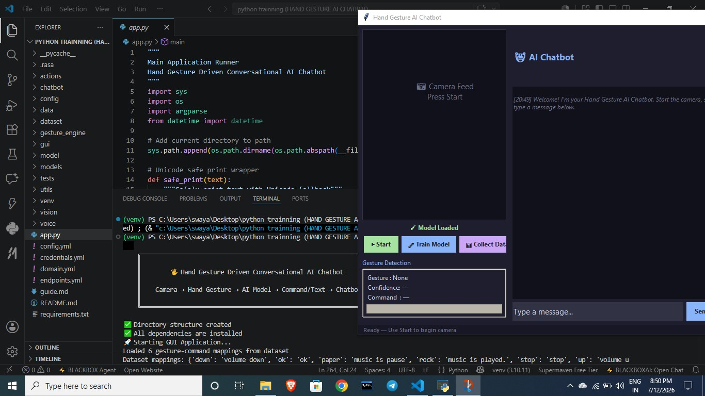
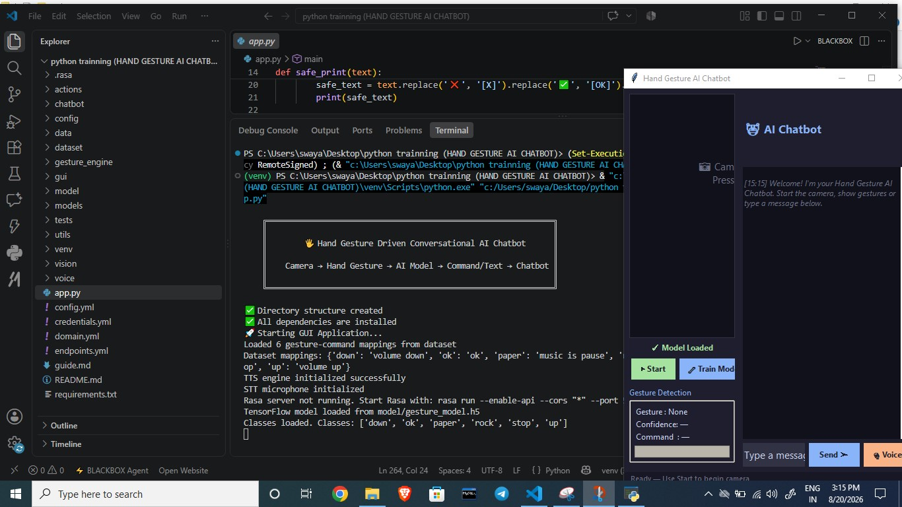
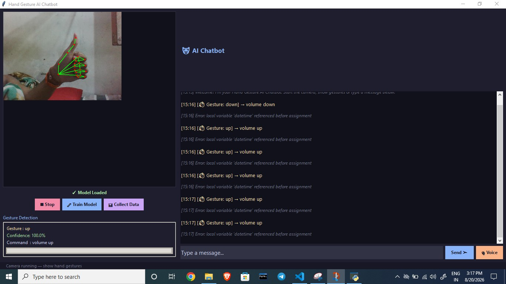

# 🖐️ Hand Gesture Driven Conversational AI Chatbot

A real-time AI chatbot that understands hand gestures using a webcam and converts them into commands or text, then responds with text or voice like a virtual assistant.

This project combines Computer Vision + Machine Learning + NLP + Speech into one intelligent system.

## 🚀 Features

- 🎥 **Real-time hand tracking** using webcam
- ✋ **Gesture recognition** using ML model
- 🔤 **Gesture → Text/Command mapping**
- 🤖 **Conversational AI chatbot** (Rasa + Fallback)
- 🔊 **Voice response** (Text-to-Speech)
- 🧠 **Train custom gestures**
- 💬 **GUI chat window**
- 📊 **Gesture confidence score**
- 🗂️ **Gesture dataset creator**
- 🧪 **Model training pipeline**
- 🧩 **Modular architecture** (easy to extend)

## 🧰 Technologies Used

| Domain | Technology |
|--------|------------|
| Computer Vision | OpenCV, MediaPipe |
| Machine Learning | TensorFlow |
| NLP / Chatbot | Rasa (optional), Fallback responses |
| Speech | pyttsx3, SpeechRecognition |
| GUI | Tkinter, Pillow |
| Language | Python 3.9+ |

## 📁 Folder Structure

```
hand-gesture-chatbot/
│
├── app.py                         # Main runner
├── requirements.txt
├── README.md
│
├── config/
│   └── settings.py                # Configuration settings
│
├── vision/                        # Part 1: Hand Tracking
│   ├── hand_tracker.py            # Hand tracking with MediaPipe
│   └── landmark_extractor.py      # Feature extraction
│
├── dataset/                       # Part 2: Gesture Dataset
│   ├── collector.py               # Data collection tool
│   └── samples/                   # Gesture samples
│
├── model/                         # Part 3: ML Model
│   ├── train.py                   # Model training pipeline
│   ├── gesture_model.h5           # Trained model
│   └── labels.pkl                # Gesture labels
│
├── gesture_engine/                # Part 4: Gesture Mapping
│   └── gesture_to_command.py      # Gesture mapping
│
├── chatbot/                       # Part 5: Chatbot Engine
│   └── rasa_bot.py               # Rasa integration
│
├── voice/                         # Part 6: Voice Engine
│   ├── tts.py                    # Text-to-Speech
│   └── stt.py                    # Speech-to-Text
│
├── gui/                           # Part 7: GUI App
│   └── interface.py               # Main GUI application
│
└── utils/
    └── helpers.py                # Utility functions
```

## 📸 Project Showcase

Here are some sample photos from the `photo` folder:





## 📋 Step-by-Step Installation Guide

### Step 1: Clone the Repository
```bash
git clone <your-repo>
cd hand-gesture-chatbot
```

### Step 2: Create Virtual Environment (Recommended)
```bash
python -m venv venv
# On Windows:
venv\Scripts\activate
# On Linux/Mac:
source venv/bin/activate
```

### Step 3: Install Dependencies
```bash
pip install -r requirements.txt
```

### Step 4: Verify Installation
```bash
python app.py --check-deps
```

## 🚀 Step-by-Step Usage Guide

### Step 1: Collect Gesture Data
Before training the model, you need to collect gesture samples.

```bash
python app.py --mode collect
```

**Instructions:**
- Follow the interactive prompts in the terminal
- Enter gesture names (e.g., "thumbs_up", "peace", "fist")
- Collect 50-100 samples per gesture for best results
- Use diverse hand positions, angles, and lighting
- Press 'q' to stop collecting for each gesture

**Example gestures to collect:**
- thumbs_up
- peace
- fist
- palm
- point

### Step 2: Train the Model
After collecting data, train the ML model.

```bash
python app.py --mode train
```

**What happens:**
- Automatically loads collected gesture data
- Trains a TensorFlow neural network classifier
- Saves the trained model to `model/gesture_model.h5`
- Saves gesture labels to `model/labels.pkl`

**Training tips:**
- More samples = better accuracy
- Ensure diverse data collection
- Monitor training progress in terminal

### Step 3: Check Application Status
Verify that everything is ready before running the GUI.

```bash
python app.py --mode status
```

This will show:
- Model status (loaded/not loaded)
- Dataset information (gestures collected, sample counts)
- Configuration status

### Step 4: Run the GUI Application
Launch the main application.

```bash
python app.py --mode gui
```

**Using the GUI:**
1. **Start Camera**: Click "▶ Start" button to begin webcam
2. **Show Gestures**: Make hand gestures to control the chatbot
3. **Text Input**: Type messages in the input field
4. **Voice Input**: Click "🎙 Voice" to speak commands (requires PyAudio)
5. **Train Model**: Click "🔧 Train Model" to retrain with new data
6. **Collect Data**: Click "📊 Collect Data" to add more gesture samples

### Step 5: Test Components (Optional)
Test individual components separately.

```bash
python app.py --mode test
```

## 🧪 How It Works (Pipeline)

```
Webcam → MediaPipe → Hand Landmarks → Feature Extraction
→ ML Model → Gesture Prediction → Command Mapping
→ Chatbot (Rasa/Fallback) → Text Response → TTS Voice → User
```

## ✋ Example Gestures

| Gesture | Action | Command |
|---------|--------|---------|
| 👍 Thumbs Up | Say Hello | "hello" |
| ✌️ Peace | Ask Time | "time" |
| ✊ Fist | Stop | "stop" |
| 🖐️ Palm | Start Listening | "start_listening" |
| 👉 Point | Select | "select" |
| 👌 OK | Confirm | "confirm" |
| 🤘 Rock | Play Music | "play_music" |
| ✋ Paper | Pause Music | "pause_music" |

## ⚙️ Configuration

Edit `config/settings.py` to customize:

### Camera Settings
```python
CAMERA_INDEX = 0              # Camera device index
CAMERA_WIDTH = 640            # Resolution width
CAMERA_HEIGHT = 480           # Resolution height
CAMERA_FPS = 30               # Frames per second
```

### Model Settings
```python
GESTURE_CONFIDENCE_THRESHOLD = 0.6   # Minimum confidence for gesture
GESTURE_HOLD_TIME = 1.0               # Time to hold gesture (seconds)
GESTURE_COOLDOWN = 3.0                # Cooldown between commands (seconds)
```

### Voice Settings
```python
VOICE_RATE = 150              # Speech rate
VOICE_VOLUME = 0.9            # Speech volume (0.0 to 1.0)
```

### Chatbot Settings
```python
CHATBOT_MODE = "fallback"     # "rasa" or "fallback"
```

### GUI Settings
```python
WINDOW_WIDTH = 800            # Window width
WINDOW_HEIGHT = 600           # Window height
```

## 🔧 Advanced Features

### Custom Gesture Mappings
Add new gesture-command mappings in `gesture_engine/gesture_to_command.py`:

```python
custom_mappings = {
    "custom_gesture": "custom_command"
}
```

### Rasa Integration (Optional)
For advanced conversational AI, you can integrate Rasa:

1. **Install Rasa:**
   ```bash
   pip install rasa
   ```

2. **Initialize Rasa Project:**
   ```bash
   rasa init
   ```

3. **Train Rasa Model:**
   ```bash
   rasa train
   ```

4. **Run Rasa Server:**
   ```bash
   rasa run --enable-api --cors "*" --port 5005
   ```

5. **Enable Rasa in Settings:**
   ```python
   # config/settings.py
   CHATBOT_MODE = "rasa"
   ```

## 🐛 Troubleshooting

### Camera Issues
**Problem:** Camera not working or black screen
**Solutions:**
- Ensure camera is not in use by other applications
- Check camera permissions in system settings
- Try different camera indices (0, 1, 2) in settings
- On Windows, try changing backend in settings

### Model Training Issues
**Problem:** Poor gesture recognition accuracy
**Solutions:**
- Collect more training data (50+ samples per gesture)
- Ensure diverse hand positions and angles
- Check for consistent lighting during data collection
- Monitor training logs for overfitting
- Retrain model with better data

### Voice Issues
**Problem:** TTS (Text-to-Speech) not working
**Solutions:**
- Check speakers are working
- Adjust voice settings in configuration
- Ensure pyttsx3 is properly installed
- Try reinstalling: `pip install pyttsx3 --force-reinstall`

**Problem:** STT (Speech-to-Text) not working
**Solutions:**
- Install PyAudio: `pip install pyaudio`
- Check microphone permissions
- Ensure microphone is not in use by other apps
- On Windows, you may need to install PyAudio from binary wheels

### Rasa Issues
**Problem:** Rasa server not connecting
**Solutions:**
- Ensure Rasa is installed: `pip install rasa`
- Check if Rasa server is running on port 5005
- Use fallback mode if Rasa is not required

## 📊 Performance Tips

- **Training**: Use GPU for faster model training (if available)
- **Inference**: Optimize model size for real-time performance
- **Camera**: Use lower resolution (640x480) for better FPS
- **Memory**: Clear conversation history periodically
- **Data Quality**: Collect diverse, high-quality gesture samples

## 🤝 Contributing

1. Fork the repository
2. Create a feature branch
3. Make your changes
4. Add tests if applicable
5. Submit a pull request

## 📝 License

This project is licensed under the MIT License.

## 🙏 Acknowledgments

- MediaPipe for hand tracking
- TensorFlow for machine learning
- Rasa for conversational AI
- OpenCV for computer vision

## 📞 Support

For issues and questions:
1. Check the troubleshooting section
2. Review the configuration settings
3. Create an issue on GitHub

---

**Happy coding! 🚀**

**Python Version:** 3.9 to 3.12
